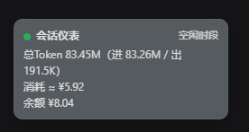

# dsh-token-rush

> A tiny "token panic" HUD pinned to the top-left of your DeepSeek Harness (DSH) Web GUI session page.
> It tells you in real time: how many tokens this session burned, roughly how much that cost, and your remaining API balance. During DeepSeek's rush hours it turns orange-red — because that's when the official price doubles.

[中文](README.md) | [English](README.en.md)

---

## Why you need it

As a broke API user, don't you have the same token anxiety I do?

Every time you ask the AI to do something, you can't help switching to the backend to check how many tokens this round burned. By the time the bill arrives, you realize the conversation felt great — but your wallet lost two pounds. Worse: between 09:00–12:00 and 14:00–18:00 (Beijing time), DeepSeek charges **2×** the normal rate during its peak hours. You thought it was a casual chat; it was actually double-priced.

**dsh-token-rush** puts the answer right on the session page's top-left corner: a small window that follows you, showing the current session's cumulative token consumption, the estimated spend at official prices, and your account balance. Whenever peak hours hit, the whole window turns orange-red — as if it is whispering in your ear:

> "Using AI right now costs double. Take it easy."



*Above: the live look during an active session — the top-left floating window showing total tokens (in/out), estimated spend and account balance; currently off-peak, so it follows the DSH theme; during rush hours the whole window turns orange-red.*

## Features

| Capability | Details |
| --- | --- |
| 🎯 Top-left floating window | A small (~216px wide) frame-wide overlay entry that never blocks main content; default position (12, 56) |
| 📊 Live stats | Current session total tokens (input/output/cache buckets) from the DSH `tokenUsage` projection (push subscription, not polling) |
| 💰 Spend estimate | Tokens × official DeepSeek price table (per model, peak/off-peak price modes); the UI marks it with ≈ |
| 🧾 Account balance | Host-side proxy for DeepSeek `GET /user/balance` with a 60s cache; reuses the API Key from "Settings → Models" — the key never leaves the server |
| 🚦 Rush-hour color | Checks the wall clock every time the DSH service starts; during peak hours (default: Mon–Fri 09:00–12:00 / 14:00–18:00 Beijing time) the window turns orange-red, otherwise it follows the current DSH theme (light/dark auto-matched) |
| 👻 Opacity fade | 0% opacity and pointer-events none before a conversation starts; fades to semi-transparent over 0.8s once you begin chatting |
| 🖱️ Drag anywhere | Hold the window and drag; position is remembered (localStorage); double-click resets to default |

## Installation

### Install from this directory (development / local use)

```powershell
dsh plugin --profile web add link:E:\万物暂存\AI缓存工作区\dsh-token-rush
```

Restart the `dsh web` process (a page refresh alone is not enough); the window appears at the session page's top-left. Verify the mount:

```powershell
dsh --profile web --dump-config | Select-String token-rush   # expect: - id: token-rush
```

### Uninstall

```powershell
dsh plugin --profile web remove dsh-token-rush
```

Restart `dsh web` to remove the window.

## Configuration (environment variables, read at `dsh web` startup)

| Variable | Description | Default |
| --- | --- | --- |
| `DSH_HUD_PEAK_WINDOWS` | Peak-hour windows, e.g. `"9-12,14-18"` or `"8-10 20-23"` (half-open [start, end)) | `9-12,14-18` |
| `DSH_HUD_PEAK_TZ` | IANA timezone for peak detection | `Asia/Shanghai` |
| `DEEPSEEK_BASE_URL` | DeepSeek API base URL override (same convention as the official llm-deepseek) | `https://api.deepseek.com` |

Balance lookup reuses the DeepSeek provider's `apiKeyEnv` (default `DEEPSEEK_API_KEY`) / `baseURL` from "Settings → Models"; without a configured key the balance row shows "No key configured".

## Data sources

| Item | Source | Notes |
| --- | --- | --- |
| Total tokens | DSH session `tokenUsage` projection (`uncachedInputTokens` / `cacheReadTokens` / `cacheWriteTokens` / `outputTokens`) | Provider-reported session totals maintained by the host; live push |
| Spend (est. ≈) | Tokens × official price table | Per-model price matching (deepseek-v4-flash / pro / …, unknown models fall back to flash), peak = 2× off-peak; see `PRICES` in `lib/index.js` |
| Account balance | DeepSeek `/user/balance` | 60s host cache; the browser polls once a minute |
| Rush-hour state | Startup check + per-minute re-check | One startup verdict is logged per DSH launch; browser and host share the same window definition (Beijing time by default) |

## Known limitations

- Spend is an **estimate**: token totals come from provider reports; price is applied at the current model (if the model changes mid-session, the last message's model wins). Actual billing is what DeepSeek says it is.
- Balance only covers the official DeepSeek API (including custom `baseURL` endpoints); with other LLM providers the balance row shows "Unavailable".
- Rush-hour detection defaults to Beijing time (matching the official billing rules); override with `DSH_HUD_PEAK_TZ` if needed.

## Development

Hand-written plain JS, **no build step**:

```text
dsh-token-rush/
├── package.json          # dsh.bundle.patch + dsh.client declarations
├── cordis.patch.yml      # plugin row: - insert - id: token-rush
├── lib/
│   ├── index.js          # host half: startup peak check + /api/token-rush/* routes
│   └── client.js         # browser half: HUD UI (window.__ModuleLoader__ factory format)
├── dev/host-smoke.mjs    # host-half smoke tests
└── README.md / README.en.md
```

```powershell
node --check lib\index.js      # host-half syntax check
node --check lib\client.js     # browser-half syntax check
node dev\host-smoke.mjs        # smoke suite (peak windows/pricing/routes/origin guard/balance proxy)
```

> Versioning follows [SemVer](https://semver.org/): `MAJOR.MINOR.PATCH` maps to breaking architecture changes, backward-compatible features, and bug fixes respectively.

## License

[MIT](LICENSE)
